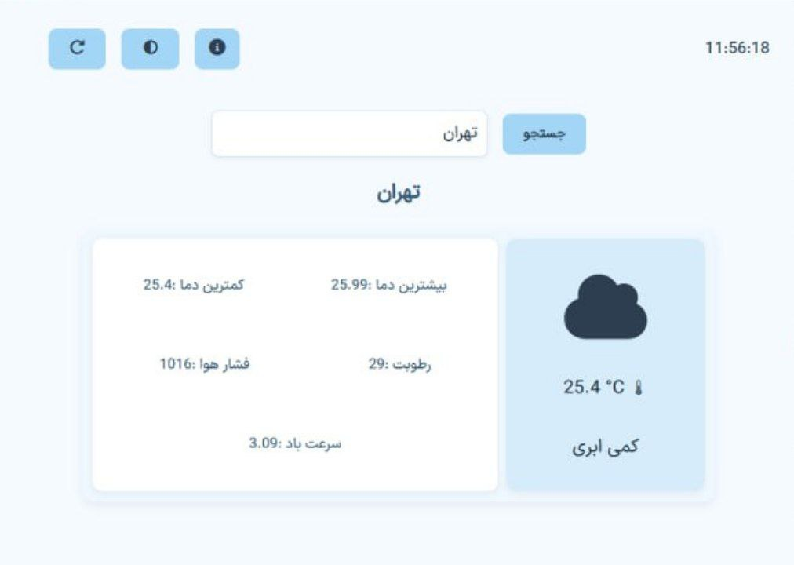

# Weather All 🌤️

A **modern desktop weather app** built with **Electron** and **Vite**, featuring **dark mode, digital clock, city-based weather info, and custom window/executable icon**.


*Example screenshot of the app in light mode.*

---

## Features ✨

* 🌡 Displays temperature, min/max temperature, humidity, pressure, and wind speed
* 🌙 **Dark mode** with toggle button and persistent theme after reload
* 🕒 **Digital clock** at the top
* 🔄 **Reload button** to refresh the page while retaining the last searched city
* ℹ️ **Info button** linking to your GitHub repository
* 🌐 Supports **OpenWeatherMap API** for real-time weather data
* 🖼 Custom icon for the Electron window and Windows EXE

---

## Prerequisites ⚙️

* Node.js >= 18
* npm or yarn
* Internet connection for fetching weather data

---

## Installation & Development 🚀

```bash
# Install dependencies
npm install

# Run in development mode
npm run dev
```

* Opens Electron window with **live reload** from Vite dev server

---

## Running Without Dev Server 🖥️

```bash
npm run start
```

* Opens Electron window directly (without Vite dev server)

---

## Building Executable (Windows EXE) 🛠️

1. Build Vite front-end:

```bash
npm run build
```

2. Package Electron app using **electron-builder**:

```bash
npm run dist
```

* The executable will be in `dist/` folder
* Installer (NSIS) and portable EXE will use the custom icon

---

## Project Structure 📂

```
project-root/
├─ public/
│  ├─ icon.ico        # App icon
│  ├─ screenshot.png  # Light mode screenshot
│  └─ demo.gif        # App demo GIF
├─ src/
│  ├─ style.css       # Styles
│  └─ app.js         # JS code
├─ index.html
├─ main.js            # Electron main file
├─ package.json
└─ README.md
```
---

## License 📝

MIT License – feel free to use and modify!

good luck developers ;)
with love Aria;

